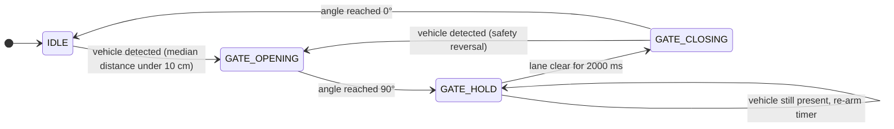

<div align="center">

# 🅿️ ParkFlow

**Non-blocking automated parking gate firmware for Arduino UNO: ultrasonic vehicle detection, median-filtered sensing, and a servo-driven boom barrier run by a finite state machine.**

<br>

[](https://docs.arduino.cc/hardware/uno-rev3/)
[](https://www.microchip.com/en-us/product/ATmega328P)
[](ParkFlow.ino)
[](LICENSE)
[](#-hardware-bill-of-materials)

<br>

`HC-SR04` &nbsp;·&nbsp; `SG90` &nbsp;·&nbsp; `millis() FSM` &nbsp;·&nbsp; `5-tap median filter` &nbsp;·&nbsp; `zero delay()`

</div>

---

## 📑 Contents

- [Overview](#-overview)
- [Hardware Bill of Materials](#-hardware-bill-of-materials)
- [Circuit & Wiring](#-circuit--wiring)
- [Finite State Machine Architecture](#-finite-state-machine-architecture)
- [Getting Started & Flashing](#-getting-started--flashing)
- [Calibration](#-calibration)
- [Future Roadmap](#-future-roadmap)
- [License & Author](#-license--author)

---

## 🔭 Overview

ParkFlow drives a small boom barrier. An **HC-SR04** ultrasonic sensor watches the lane. When the filtered distance drops below **10 cm**, an **SG90** servo sweeps the gate up to **90°**, holds it open for **2000 ms** after the lane clears, then lowers it back to **0°**.

| Layer | Implementation |
| :--- | :--- |
| **Scheduling** | Cooperative super-loop. Every timed action is compared against `millis()`, and `delay()` is never called. |
| **Sensing** | One ping every 60 ms (datasheet cycle). Echo width is converted with $d = \dfrac{t \cdot 0.0343\ \text{cm/}\mu\text{s}}{2}$. |
| **Filtering** | 5-sample ring buffer with a **median** filter, which rejects single-shot outliers (multipath, crosstalk, missed echoes) without the lag and smearing of a moving average. |
| **Control** | 4-state FSM: `IDLE` → `GATE_OPENING` → `GATE_HOLD` → `GATE_CLOSING`. |
| **Actuation** | 1° per 10 ms stepped sweep, so a full stroke takes about 0.9 s. Gradual motion also lowers the servo's current spikes. |
| **Safety** | The hold timer re-arms while a vehicle is present, and a detection during `GATE_CLOSING` sends the gate back up. |
| **Footprint** | 5,718 B flash (17 %) · 329 B SRAM (16 %) *(arduino-cli, AVR core 1.8.8)* |

> [!NOTE]
> The only blocking calls are the 12 µs trigger pulse and `pulseIn()`. `pulseIn()` is capped at `ECHO_TIMEOUT_US = 6000` µs, which covers about 1 m of range. In the worst case the loop stalls for about 6 ms once every 60 ms. It never waits on the gate.

---

## 🧰 Hardware Bill of Materials

| # | Component | Specification | Role |
| :-: | :--- | :--- | :--- |
| 1 | **Arduino UNO R3** | ATmega328P @ 16 MHz, 32 KB flash, 2 KB SRAM, 5 V logic | Main controller, runs the FSM |
| 1 | **HC-SR04** | 40 kHz ultrasonic, 2–400 cm, ~15 mA, 5 V TTL echo | Vehicle presence detection |
| 1 | **SG90 micro servo** | 4.8–6 V, ~1.8 kg·cm, 50 Hz PWM, stall ≈ 650 mA | Boom barrier actuator |
| 1 | **5 V DC supply** | ≥ 1 A (recommended for the servo rail) | Isolates servo current spikes from the MCU |
| 1 | **C1: electrolytic capacitor** | 470–1000 µF, ≥ 10 V | Bulk reservoir across servo V+/GND |
| 1 | **C2: ceramic capacitor** | 100 nF (0.1 µF) | Decoupling at HC-SR04 VCC/GND |
| — | Breadboard + jumper wires | 22 AWG / Dupont | Interconnect |
| — | Boom arm | Popsicle stick, 3D print, or servo horn extension | The gate itself |

---

## 🔌 Circuit & Wiring

### Signal wiring

```text
     HC-SR04                    ARDUINO UNO R3                     SG90 SERVO
  ┌───────────┐              ┌──────────────────┐              ┌───────────────┐
  │       VCC ├──────────────┤ 5V          D6   ├──────────────┤ SIG  (orange) │
  │      TRIG ├──────────────┤ D9               │              │ V+   (red)    ├──► servo rail +5V
  │      ECHO ├──────────────┤ D10              │              │ GND  (brown)  ├──► common GND
  │       GND ├──────────────┤ GND              │              └───────────────┘
  └───────────┘              └──────────────────┘
```

### Power topology (recommended)

```text
   EXTERNAL 5 V SUPPLY (≥ 1 A)
  ┌───────────────────┐
  │              +5V  ├────────┬────────────────────────► SG90  V+   (red)
  │                   │        │
  │                   │   C1  ─┴─  470–1000 µF electrolytic
  │                   │   (+) ─┬─  ≥ 10 V, placed at the servo
  │                   │        │
  │              GND  ├────────┴───────────┬────────────► SG90  GND  (brown)
  └───────────────────┘                    │
                                           └────────────► UNO   GND  ◄── common ground (required)

  UNO 5V  ──┬──────────► HC-SR04 VCC
            │
       C2  ─┴─  100 nF ceramic, at the sensor pins
           ─┬─
            │
  UNO GND ──┴──────────► HC-SR04 GND
```

### Pin mapping

| Arduino Pin | Dir | Connected To | Signal | Notes |
| :-: | :-: | :--- | :--- | :--- |
| **D9** | OUT | HC-SR04 `TRIG` | ≥ 10 µs HIGH trigger pulse | Servo.h takes over Timer1, so `analogWrite()` on D9 stops working. That doesn't matter here because D9 is used as plain GPIO. |
| **D10** | IN | HC-SR04 `ECHO` | HIGH pulse, width ∝ round-trip time | 5 V logic, native to the UNO. Read with `pulseIn()`. |
| **D6** | OUT | SG90 `SIG` (orange) | 50 Hz servo pulse, 544–2400 µs | Generated by the Servo.h Timer1 ISR |
| **5V** | PWR | HC-SR04 `VCC` | +5 V | ~15 mA sensor load |
| **GND** | PWR | HC-SR04 `GND`, SG90 `GND`, PSU − | 0 V reference | All grounds must be tied together |
| — | PWR | SG90 `V+` (red) | +5 V from external supply | Keep the servo current off the UNO regulator |

### Electrical considerations

> [!WARNING]
> **Servo inrush and stall current.** An SG90 draws roughly 100–250 mA while moving and can spike to about **650 mA** at start-up or stall. A USB-powered UNO sits behind a 500 mA polyfuse, so those spikes pull the 5 V rail down. The usual symptoms are random MCU resets (brown-out), servo jitter and garbage distance readings. Power the servo from its own 5 V supply.

- **Common ground is mandatory.** The servo control pulse and the echo pulse are both measured against GND. If the grounds float, the servo twitches or ignores its commands.
- **Bulk capacitor (C1).** 470–1000 µF across the servo's V+/GND, as close to the servo as possible, supplies the current spikes locally. Mind the polarity.
- **Decoupling (C2).** 100 nF ceramic across HC-SR04 VCC/GND suppresses high-frequency noise coupled from the servo motor.
- **Soft motion in firmware.** The 1°/10 ms stepped sweep limits acceleration, which lowers the peak current compared with a single `write(90)` jump.
- **Never** power the servo from the UNO's `3.3V` pin (~150 mA max) or feed it through `Vin`.

> [!TIP]
> Bench testing on USB alone with a bare servo usually works if C1 is fitted. Switch to the external supply as soon as the boom arm adds load, or if the serial log shows unexpected `ParkFlow ready.` lines (MCU resets).

> [!TIP]
> Mount the sensor so the boom arm **never crosses the ultrasonic beam**. Otherwise the gate will detect itself and stay open.

---

## 🧠 Finite State Machine Architecture



| State | Action (every loop pass) | Exit condition | Next |
| :--- | :--- | :--- | :--- |
| `IDLE` | Gate at 0°, sensing only | `vehiclePresent` | `GATE_OPENING` |
| `GATE_OPENING` | `sweepToward(90)`: +1° every 10 ms | angle == 90° | `GATE_HOLD` |
| `GATE_HOLD` | Re-arm timer while `vehiclePresent` | `millis() - stateSinceMs ≥ 2000` | `GATE_CLOSING` |
| `GATE_CLOSING` | `sweepToward(0)`: −1° every 10 ms | vehicle detected, **or** angle == 0° | `GATE_OPENING`, **or** `IDLE` |

### Loop anatomy

```text
loop() ─┬─► 1. SENSE   every 60 ms: ping → ring buffer[5] → median → cm → vehiclePresent
        │
        └─► 2. DECIDE  switch(state) → sweepToward() / timer check → enterState()
                         (each branch returns immediately; nothing waits)
```

All timers use the `now - lastEventMs >= INTERVAL` idiom. Because the arithmetic is unsigned, it stays correct across the `millis()` rollover every ~49.7 days.

### Distance math

```text
c (20 °C)  = 343 m/s  =  0.0343 cm/µs
distance   = t_echo × 0.0343 / 2            (÷ 2: the pulse covers the round trip)
           ≈ t_echo / 58.3
10 cm      ↔  ~583 µs echo
timeout    =  6000 µs  ↔  ~103 cm (read as "no vehicle")
```

> [!NOTE]
> The speed of sound drifts about 0.18 % per °C ($c \approx 331.3 + 0.606\,T$ m/s). At 35 °C a 10 cm threshold reads about 0.3 cm off. Adjust `SOUND_CM_PER_US` for extreme climates.

---

## 🚀 Getting Started & Flashing

### 1 · Clone

```bash
git clone https://github.com/Eng-Meshari/ParkFlow.git
```

> [!IMPORTANT]
> The folder name must match the sketch name (`ParkFlow/ParkFlow.ino`), or the Arduino toolchain will refuse to open it.

### 2a · Arduino IDE (2.x)

1. **File → Open…** → `ParkFlow/ParkFlow.ino`
2. **Library:** make sure **Servo** by Arduino is installed (**Sketch → Include Library → Manage Libraries…** → search `Servo`).
3. **Tools → Board →** Arduino AVR Boards → **Arduino Uno**
4. **Tools → Port →** your board's COM / `tty` port
5. Click **Upload** (→).
6. **Tools → Serial Monitor** at **115200 baud**.

### 2b · arduino-cli

```bash
arduino-cli core update-index
arduino-cli core install arduino:avr
arduino-cli lib install Servo

arduino-cli compile --fqbn arduino:avr:uno ParkFlow
arduino-cli board list                                   # find your port
arduino-cli upload  -p COM3 --fqbn arduino:avr:uno ParkFlow   # Linux/macOS: /dev/ttyACM0
arduino-cli monitor -p COM3 -c baudrate=115200
```

### 3 · Verify

Wave a hand within 10 cm of the sensor. The serial log should show the full cycle:

```text
ParkFlow ready.
4821 ms  IDLE -> GATE_OPENING  (d = 6.2 cm)
5732 ms  GATE_OPENING -> GATE_HOLD  (d = 6.4 cm)
8410 ms  GATE_HOLD -> GATE_CLOSING  (d = 102.9 cm)
9321 ms  GATE_CLOSING -> IDLE  (d = 102.9 cm)
```

---

## 🔧 Calibration

Real sensors and servos never match the datasheet. Every tuning value is a `const` at the top of [`ParkFlow.ino`](ParkFlow.ino):

| Constant | Default | Tune when… |
| :--- | :-: | :--- |
| `DETECT_THRESHOLD_CM` | `10.0` | Mounting distance to the lane changes |
| `GATE_CLOSED_ANGLE` / `GATE_OPEN_ANGLE` | `0` / `90` | Arm isn't level, or the servo is mounted inverted (the sweep works in either direction) |
| `HOLD_TIME_MS` | `2000` | Vehicles need more time to clear the gate |
| `SERVO_STEP_MS` | `10` | You want a faster or slower sweep (the stroke takes 90 × this value) |
| `PING_INTERVAL_MS` | `60` | Keep ≥ 60 ms to avoid echo crosstalk |
| `ECHO_TIMEOUT_US` | `6000` | You raise the threshold beyond ~1 m (≈ 58 µs per cm) |
| `SOUND_CM_PER_US` | `0.0343` | Ambient temperature is far from 20 °C |

---

## 🧭 Future Roadmap

- [ ] **Status display:** I²C 16×2 LCD or SSD1306 OLED showing gate state and free-slot count
- [ ] **RFID access control:** MFRC522 reader so only whitelisted tags open the gate
- [ ] **Occupancy counting:** entry/exit sensor pair with direction detection and a capacity limit
- [ ] **Cloud logging / IoT:** port to ESP32 and publish events over MQTT to a dashboard (note that the ESP32 needs a 5 V → 3.3 V divider on `ECHO`)
- [ ] **Temperature compensation:** DS18B20 / DHT22 to correct the speed of sound at runtime
- [ ] **Redundant safety:** IR break-beam under the boom, and limit switches to confirm the end positions
- [ ] **Low-power idle:** sleep between pings for battery or solar installs

---

## 📜 License & Author

Released under the **[MIT License](LICENSE)**. You're free to use, modify and distribute it, including commercially, with attribution.

<div align="center">

Built by **Meshari** · [@Eng-Meshari](https://github.com/Eng-Meshari)

<sub>If ParkFlow helped your project, consider leaving a ⭐</sub>

</div>
